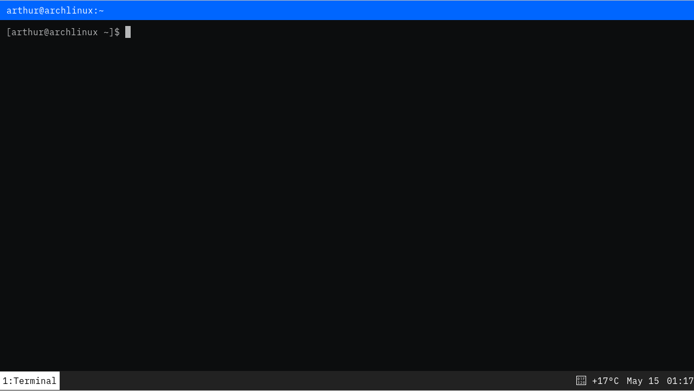

## About

- i3+config files.
- Archlinux installation script.

## Roadmap

- [ ] Write instructions.
- [ ] Fix network not working on boot--use `sudo dhcpcd <device>` for now.
- [ ] Fix keyboard layout on X11.
- [ ] Fix colors in urxvt.
- [ ] Finish i3blocks config.
- [ ] Add missing software to installation script.
- [ ] Setup zsh with [prezto](https://github.com/sorin-ionescu/prezto) and [spaceship](https://github.com/denysdovhan/spaceship-prompt).

## Reference

- https://wiki.archlinux.org/index.php
- https://www.reddit.com/r/unixporn
- https://tutos.readthedocs.io/en/latest/source/Arch.html
- https://www.youtube.com/watch?v=Api6dFMlxAA
